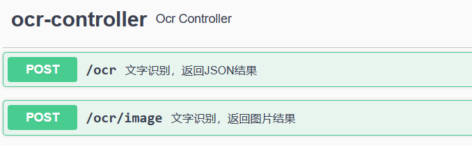
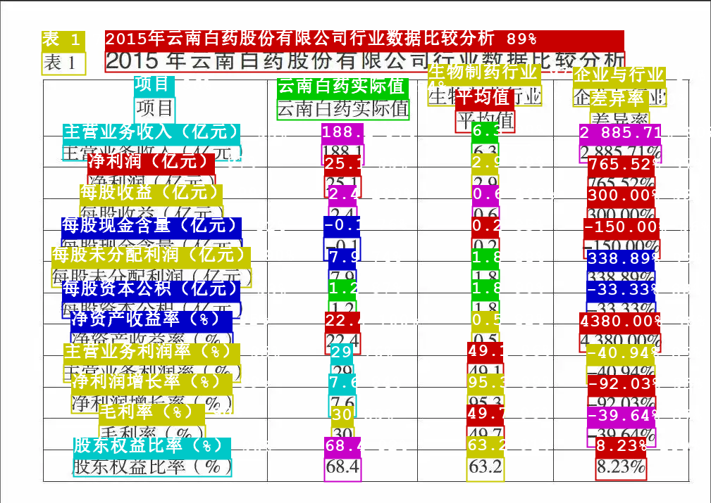

<h3 align="center">java-springboot-paddleocr</h3>

<!-- TABLE OF CONTENTS -->

  
Table of Contents

  <ol>
    <li>
      <a href="#about">About</a>
    </li>
    <li>
      <a href="#getting-started">Getting Started</a>
    </li>
    <li>
          <a href="#result">Result</a>
        </li>
    <li>
      <a href="#contact">Contact</a>
    </li>
    <li>
       <a href="#reference">Reference</a>
    </li>
    
  </ol>

#### About

本项目利用java加载paddle-ocr的C++编译后的可执行文件exe（准确度与python版paddle-ocr一样），并利用springboot进行web部署访问。

#### Getting started
paddle-ocr c++编译模型下载，下载后放入resources下

链接：https://pan.baidu.com/s/1Pj2IxSgpdVNeHljAcHiI4Q 

提取码：x9m5

项目启动后访问 http://localhost:8080/swagger-ui/ 测试

   

  

  

其中：

1./ocr：返回json结果（包括识别的文字，坐标以及置信度）

2./ocr/image：返回识别后绘制的图片结果
#### Result
##### /ocr，返回json结果
    
    [
      {
          "text": "表 1",
          "box": [
            [
              59,
              74
            ],
            [
              121,
              74
            ],
            [
              121,
              106
            ],
            [
              59,
              106
            ]
          ],
          "score": 0.7097494006156921
        },
        {
          "text": "2015年云南白药股份有限公司行业数据比较分析",
          "box": [
            [
              149,
              73
            ],
            [
              886,
              72
            ],
            [
              886,
              101
            ],
            [
              149,
              102
            ]
          ],
          "score": 0.8905224800109863
        },
      ...
    ]
    
##### /ocr/image，返回图片结果

   

  

  

#### Contact
如有问题，联系我：

1、github：https://github.com/jiangnanboy

2、QQ:2229029156

#### Reference
https://github.com/PaddlePaddle/PaddleOCR

https://github.com/jiangnanboy/doc_ai

https://github.com/deepjavalibrary/djl

https://github.com/jerrylususu/PaddleOCR-json-java-api

https://github.com/hiroi-sora/PaddleOCR-json

